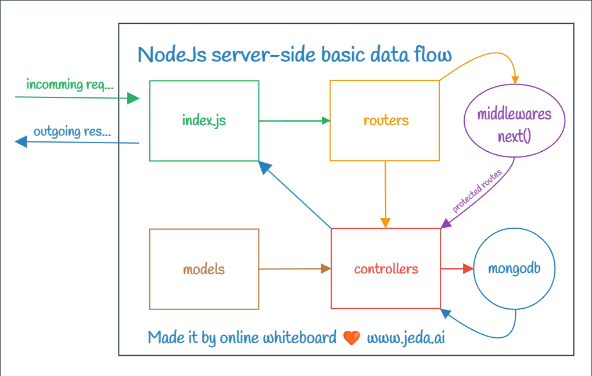

> 10 - July - 2024

# Learning Backend

### Packages
- yarn add jsonwebtoken 
- yarn add body-parser
- yarn add mongoose
- yarn add nodemon
- yarn add express
- yarn add dotenv
- yarn add bcrypt
- yarn add cors
- yarn add joi


<br />

## User Auth:-

| No  | Context       | Method | Api Endpoint      | File Link           |
| --- | ------------- | ------ | ------------------|---------------------|
| 1   | Registration  | POST   | `/auth/register`  | [register][userReg] |
| 2   | Login         | POST   | `/auth/login`     | [login][userLog]    |


[userReg]: ./src/controllers/auth/registration.js
[userLog]: ./src/controllers/auth/login.js


<br />

## Learning insight:- 

### Testing Backend Without Frontend 

1. **Create Backend System**
   - Develop the backend with the required functionality & endpoints (GET, POST, PUT, DELETE).

2. **Need for Testing**
   - You need to test the POST method to ensure it processes input data correctly.

3. **No Frontend Application**
   - Assume there is no frontend application ready to send input data.

4. **Using Postman**
   - Use a tool like Postman to test the backend system.
   - Postman allows you to send POST requests & see responses.

5. **Verify Functionality**
   - Ensure the response matches the expected output.
   - Check for any errors or issues.

6. **Adjust Backend if Necessary**
   - Make necessary adjustments based on the response.
   - Retest using Postman until it works as expected.

These steps help to test a backend system using Postman without needing a frontend application.


```
* server & its library related error set inside ==> INTERNAL_SERVER_ERROR

* if token manipulated by user then...
   * [invalid signature] error set inside ==> (token validation)FORBIDDEN


```

<br/>

## NodeJs | Backend Basic Data Flow...


<br/>

## JWT System
